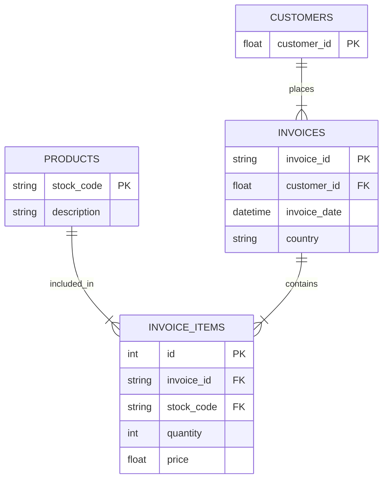

# Database Integration and Design

## 1. Database Choice: SQL (SQLite)
We have selected **SQL** (specifically **SQLite**) for this project.

### Reasoning
*   **Structured Data**: The dataset (`Online Retail II`) contains highly structured transactional data (Invoices, Customers, Products) which fits perfectly into the relational model.
*   **E-commerce Context**: As you noted, e-commerce stores require strict relationships (e.g., an Invoice *must* belong to a Customer). SQL enforces these via Foreign Keys.
*   **Analytical Needs**: SQL allows for powerful `JOIN` and `GROUP BY` operations, which are essential for calculating metrics like "Revenue by Country" or "Top Customers".
*   **Portability**: SQLite is file-based, making it incredibly easy to deploy (just copy the file) without needing a separate database server. This is ideal for this analysis dashboard.

## 2. Database Design (Schema)
We have implemented a normalized **Star Schema** optimized for both data integrity and query performance.

### ER Diagram (Entity-Relationship)

### Table Definitions

#### `customers`
*   **Purpose**: Stores unique customers to prevent duplication.
*   **Primary Key**: `customer_id`

#### `products`
*   **Purpose**: Catalog of all items sold.
*   **Primary Key**: `stock_code`
*   **Attributes**: `description`

#### `invoices`
*   **Purpose**: The header for each transaction.
*   **Primary Key**: `invoice_id`
*   **Foreign Key**: `customer_id` (links to `customers`)
*   **Attributes**: `invoice_date`, `country`

#### `invoice_items`
*   **Purpose**: The line items (products) within each invoice.
*   **Primary Key**: `id` (Auto-increment)
*   **Foreign Keys**:
    *   `invoice_id` (links to `invoices`)
    *   `stock_code` (links to `products`)
*   **Attributes**: `quantity`, `price`

## 3. Data Integrity
*   **Foreign Keys**: Enabled to ensure we don't have *orphan records* (e.g., an item belonging to a non-existent invoice).
*   **Data Types**: `TIMESTAMP` for dates and `REAL` for prices ensure calculations are accurate.
